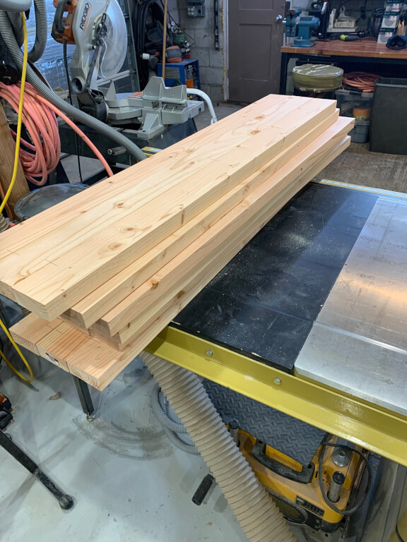
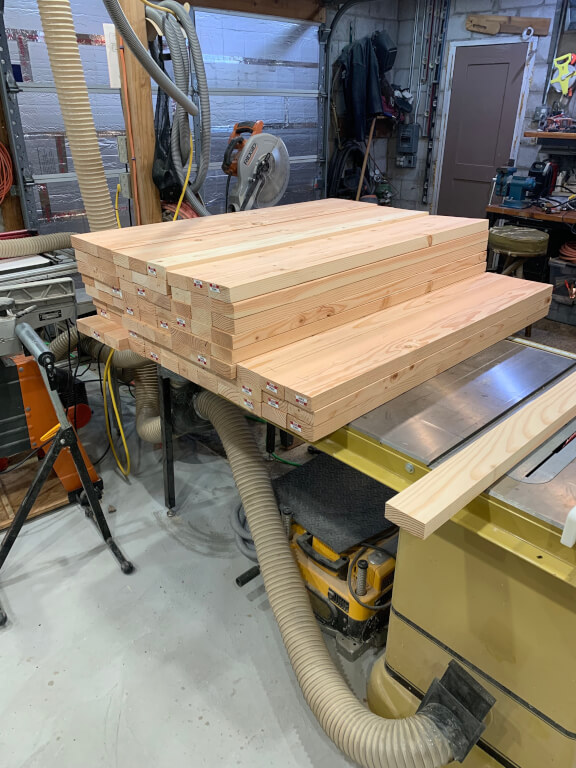
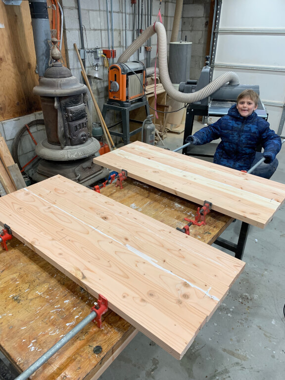

# Herb Garden Boxes

This project has been put on hold and the wood stored away.  Maybe this next summer I'll come in and finish it.

Essentially this project is a series of boxes build out of 2x4 construction lumber that has been dimensioned and joined
together to make the walls.  There will be 3 boxes that will be lined up next to one another and with the middle box
being taller than the side boxes.

The original thought was to make the boards just wide enough to fit into my planer.  This turned out to be sets of 3
joined boards.

Then I got a drum sander.  This meant I wasn't limited to the width of my Rigid Planer!  Here, with the help of my son,
I'm building 6 board-width boards.

