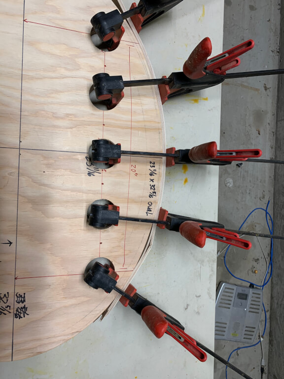
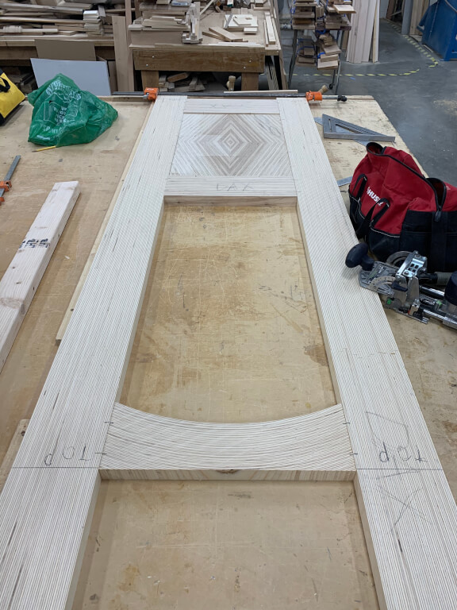
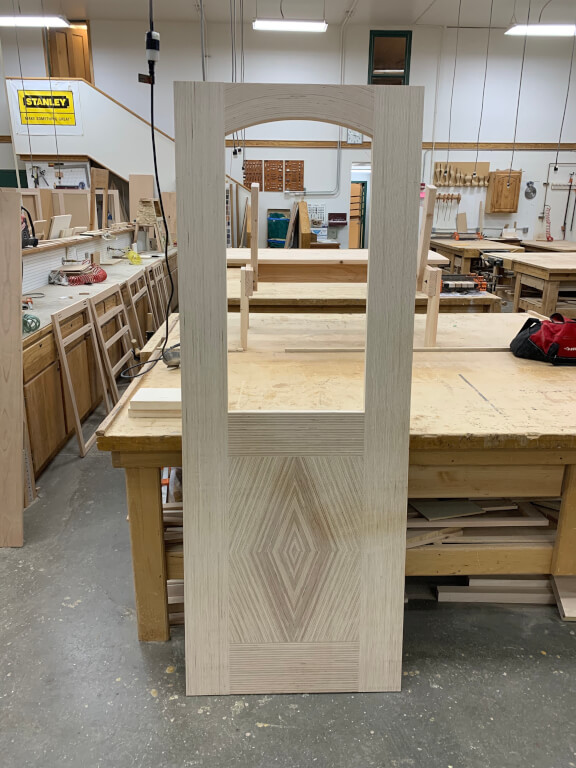
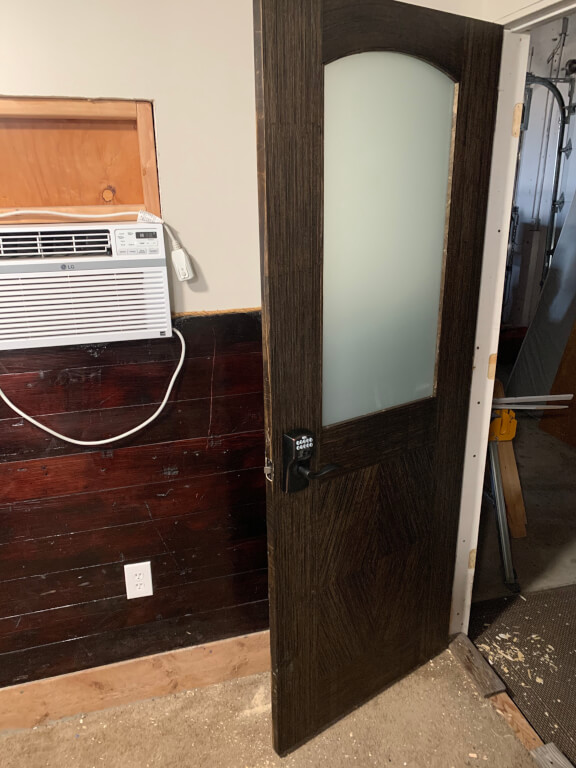

# Office Door

This is the first door I've every made.  I wanted to try out something and since I'm primarily the only person to see
or use my office door I thought this would be a safe place to try something different.

This door is constructed purely out of Baltic Birch plywood.  I laminated strips of Baltic Birch plywood into "boards"
and then constructed my door out of that.

I wanted the "grain" of the plywood to show fairly prominently but I didn't want the door to be light colored.  The main
driver for this project was that I wanted the arched wood (the top rail) to have the grain arched instead of the typical
top rail having a cutout for the arch.

## Building the Arch
I didn't have any specific arch angle in mind so I just made what I could and went with it.

I had already built-up the boards that would become the styles out of 3/8 inch plywood but even the gentler sloped side
of my form caused the 3/8 inch wood to crack.

So, I create new strips out of 1/4 inch plywood.  This thickness worked great!

## Jumping WAY Ahead
I don't have any pictures of the other parts of the build.  That said, I'm really pleased with myself on the diamond
shape of the bottom panel!  That too is laminated layers of Baltic Birch plywood.  I made this huge block and then cut
out the "book end" layers so that their shapes would match.

Laying out for where I'm going to domino the pieces together.

## Glue Up
The bottom panel is domino'ed and glued into the rails and styles.  (Which are also domino'ed and glued.)

Here is the door cleaned up after the glue up.

## Stain and Finish
Most of the work on the door was done at a "Continuing Education" class I took from my local community college.  I move
the project to my shop to stain and finish.

## Upper Panel
I wanted a frosted glass upper panel.  I figured the "glow" of the upper panel would look cool.

However, I was concerned with the gap on the cut glass I was given.  In the end it turned out okay as the cutter gave
me some rubber spacers.

## Door Installed

